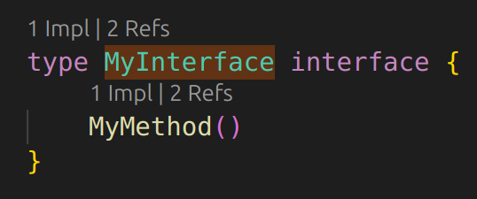

# Go Help

A simple extension that provides QoL improvements when working within Go.

## Features
- Interface CodeLenses for implementations and references.

## Requirements

- VSCode Go extension
- gopls

## Extension Settings

* `gohelp.codeLens.interfaces.implementations.names`: Display interface implementations code lens. Note if this is disabled, so are interface methods.
* `gohelp.codeLens.interfaces.implementation.methods`: Display interface method implementations code lens.
* `gohelp.codeLens.interfaces.references.names`: Display interface references code lens. Note if this is disabled, so are interface methods.
* `gohelp.codeLens.interfaces.references.methods`: Display interface method references code lens.

